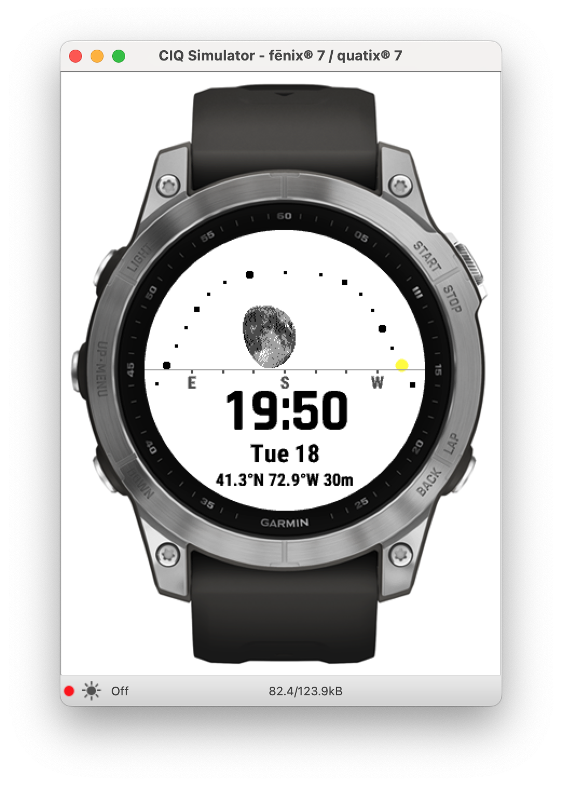
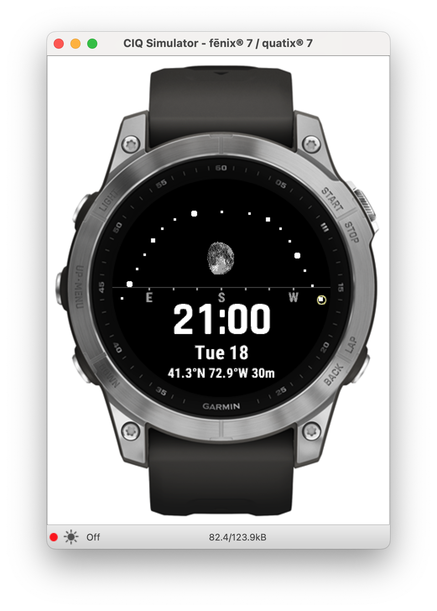

# Moon Watchface for Garmin Fenix 7

Shows the path of the sun through the sky, with the daylight hours marked along it,
and the current location of the sun and moon.

Below that, the time as `HH:MM` or `HH:MM:SS`, followed by day-of-week and -month,
and finally the coordinates being used for projection.

The idea is to visualize the spatial relationship between viewer, sun, and moon, and how
the moon's appearance changes as a result. More simply, it shows when and where to look for the moon
in the sky.

## Implementation

Rendering of the moon is split over multiple frames to stay under the execution time limit imposed
on watchfaces. This seems to work well in practice, with the drawing rarely being noticeable in
normal use. In the simulator, you can easily watch the moon fill in across a few frames.
Note: that approach doesn't actually save any power; it's just working around the platform's
constraints.

Once a complete image is assembled, it's stored offscreen and re-used for several minutes,
until some rotation will have occurred and then a new image is generated. Similar savings
could be achieved by also caching the background with the hour indices in another offscreen buffer,
but it would consume a lot more memory (from the Graphics pool.)

The data behind the moon's image is stored in obfuscated JSON form, since the fastest, most
compact form I could get to work was `Array<Number>`, at 5 bytes in memory per 32-bits of data.
5 pixels are packed into each word (6-bits each), with all the indexing and bit-manipulation
done during drawing. Even so, a significant portion of the time is spent in `Dc.setColor` and
`.drawPixel`, which I haven't been able to avoid.

## Limitations

Hasn't been used with locations/times where the sun and moon are in the *northern* sky.

Currently only configured to work on Fenix7 and SDK 4.2.x; could probably be ported to recent
circular MIP-display models without too much trouble. Not sure how easy it would be to port to
earlier API versions.

Not yet dithering the moon's image. That will make it a much more compelling visual.

For AMOLED models, would want to try a more subtle design, and there would be no need to dither
the moon image (but you might want to start with more resolution and bit-depth.)

## License

TBD
