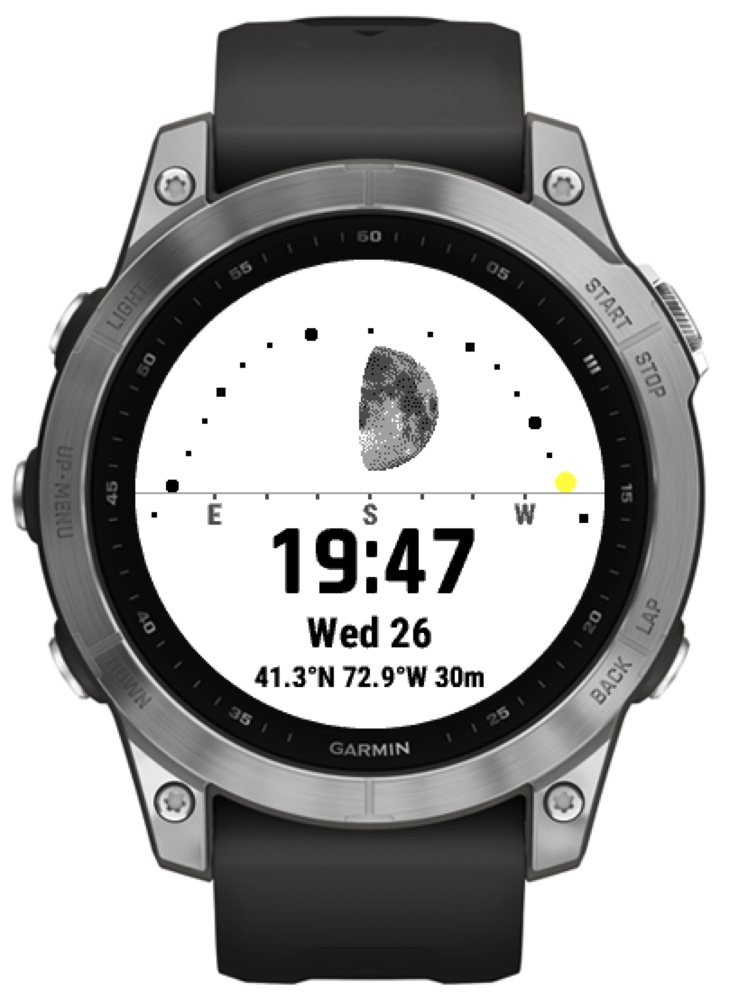
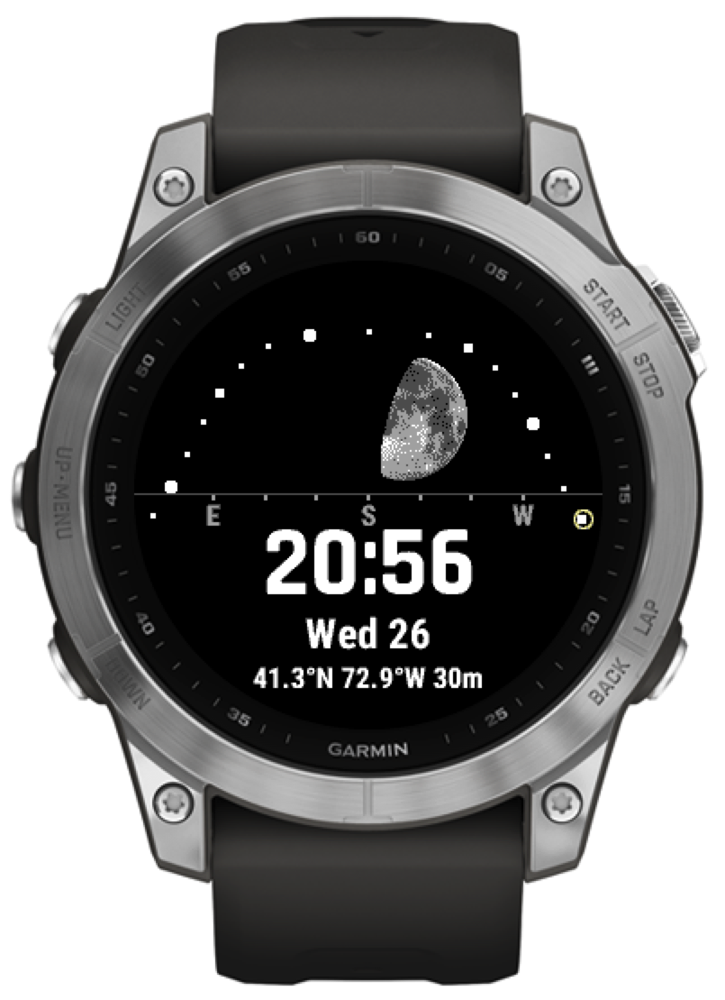

# Moon Watchface for Garmin Fenix 7

Shows the path of the sun through the sky, with the daylight hours marked along it,
and the current location of the sun and moon.

Below that, the time as `HH:MM` or `HH:MM:SS`, followed by day-of-week and -month,
and finally the coordinates being used for projection.

The idea is to visualize the spatial relationship between viewer, sun, and moon, and how
the moon's appearance changes as a result. More simply, it shows when and where to look for the moon
in the sky.

## Implementation

Images of the moon are rotated, scaled, and dithered to the MiP 64-color palette at build time,
including an image for each step of rotating through 90 degrees. On each update, the appropriate
image is chosen, rendered into an offscreen buffer (with rotation in ncrements of 90°), and then
the "dark" portion of the disk is erased.

That erasing now turns out to be the bottleneck, with lots of geometry to find the exact pixel
boundaries of the moon's image for each row of the image, and then a `Dc.clear()` call.

The actual drawing is relatively quick, even with a rotation and scale transform involved.

## Limitations

Hasn't been used with locations/times where the sun and moon are in the *northern* sky.

Currently only configured to work on Fenix7 and SDK > 4.2.1; could probably be ported to recent
circular MIP-display models without too much trouble. Not sure how easy it would be to port to
earlier API versions.

For AMOLED models, would want to try a more subtle design, and there would be no need to dither
the moon image (but you might want to start with more resolution and bit-depth.)
